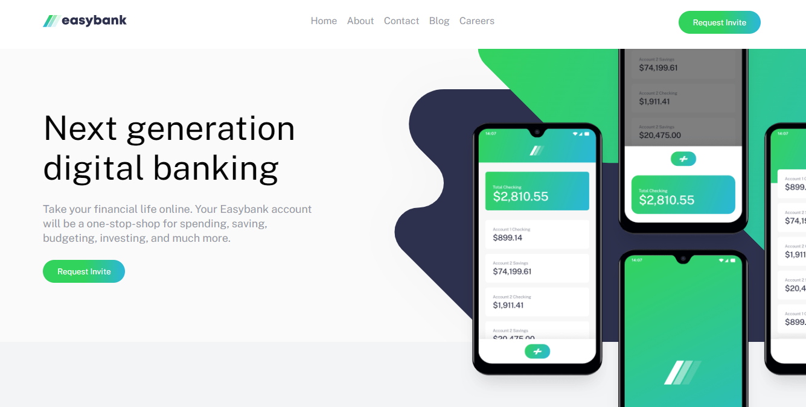

# Frontend Mentor - Easybank landing page solution

This is a solution to the [Easybank landing page challenge on Frontend Mentor](https://www.frontendmentor.io/challenges/easybank-landing-page-WaUhkoDN). Frontend Mentor challenges help you improve your coding skills by building realistic projects. 

## Table of contents

- [Overview](#overview)
  - [The challenge](#the-challenge)
  - [Screenshot](#screenshot)
  - [Links](#links)
- [My process](#my-process)
  - [Built with](#built-with)
  - [What I learned](#what-i-learned)
- [Author](#author)

## Overview

### The challenge

Users should be able to:

- View the optimal layout for the site depending on their device's screen size
- See hover states for all interactive elements on the page

### Screenshot




### Links

- Solution URL: [Frontend Mentor Solution](https://www.frontendmentor.io/solutions/responsive-easy-bank-landing-page-with-css-bem-for-desktop-and-mobile-EAUxYS0mt)
- Live Site URL: [Easy Bank](alosoft.github.io/frontend_mentor-easybank-landing-page-master/)


### Built with

- Semantic HTML5 markup
- CSS custom properties
- Flexbox
- Deesktop-first workflow

### What I learned
I learned how to use the pseudo element selector to position the phone mockup.
```css
.main::before {
    content: "";
    position: absolute;
    right: 0;
    width: 60%;
    height: 120vh;
    background:
        url(./images/image-mockups.png) top -7rem right -10rem no-repeat;
    background-size: 46rem;
}
```


## Author

- Website - [Raymond Adutwum Agyei](https://corps-ai.herokuapp.com)
- Frontend Mentor - [@alosoft](https://www.frontendmentor.io/profile/alosoft)
- Linkedin - [Raymond Adutwum Agyei](https://www.linkedin.com/in/raymond-adutwum-agyei-366929117/)
